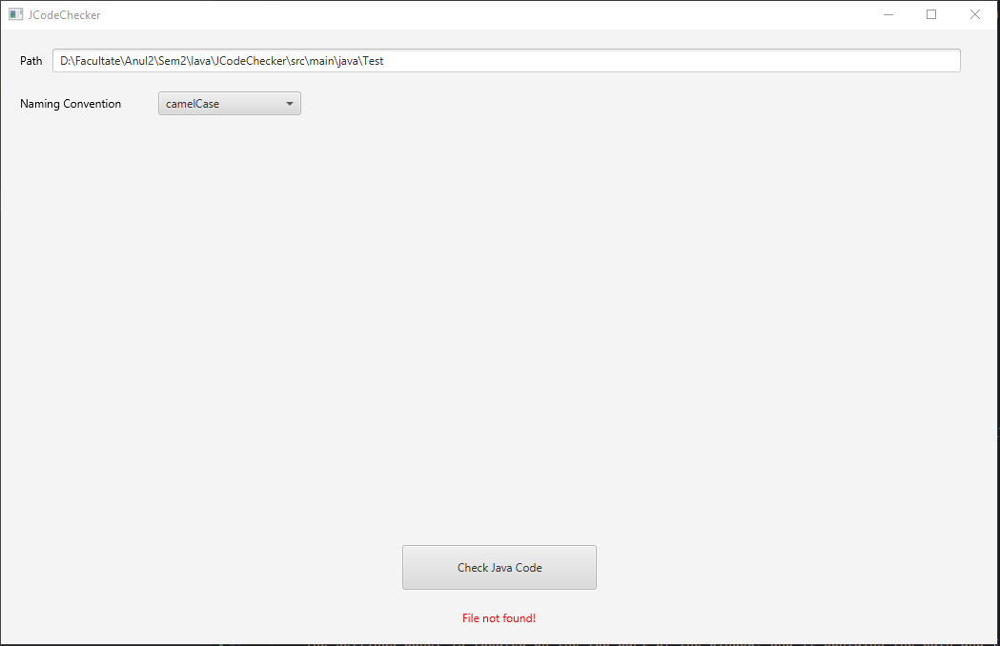

A java application that evaluates basic aspects of code quality within a small codebase using JavaFX.

To run the app you need to have JavaFX installed.

**DOWNLOAD JAVAFX**

Steps to download JavaFX:

1. Download and install JavaFX SDK: If your JDK does not include JavaFX (which is often the case with JDK versions 11 and later), you need to download and install the JavaFX SDK separately. You can download it from the official OpenJFX website: https://openjfx.io/.

2. Add JavaFX libraries to your project: Once your project is created, you need to add the JavaFX libraries to it. Follow these steps:

	Go to File > Project Structure....

	Under Project Settings, select Libraries.

	Click the + button.

	Navigate to the directory where you installed JavaFX SDK and select the lib folder.

	Click OK to add the library.

**RUN**

To run the code, go to src/main/java/com.src.jcodechecker/MainApplication.java .

Select run or debug.

**APPROACH**

I have chosen to use JavaFX because of its rich user interface and its cross-platform compatibility.

**FUNCTIONALITY**

The app is divided into three parts:

1. Settings Panel

	The settings panel is located on the top part of the window, and it contains the path and the naming convention dropdown. The path accepts only files that have the extension .java. For now, there are two naming conventions that you can choose from(camelCase and snake_case) (More to be added in the future).

2. Info Panel

    The info panel contains statistics about the java file. It shows you the 3 most complex methods based on the number of conditional statements (if, switch, while, for). It also shows how many methods are in the file, methods that do not adhere to the specified naming convention, and also a percentage.

3. Footer Panel
	
	Lastly, the footer panel contains the button that generates the statistics, but also an error message that pops up when the file does not exist or the file is not of type java.
   

**CODE ARCHITECTURE**

The application starts from the MainApplication class. It extends the Application class provided by JavaFX and overrides its start method, where it is defined the initialization and setup of the JavaFX application. The FXMLLoader is responsible for loading the FXML file(in our case the main-view.fxml file), which is responsible for the layout of the main scene.
In the main method of the class, it calls the launch() function provided by the Application class, which starts the JavaFX application by initializing the JavaFX toolkit and calling the start() method overridden in the same class. 

Once the flow is loaded, the control flow is passed to the MainController. The MainController class is responsible for managing the UI components. The UI is divided into 3 parts, the settings panel, info panel and the footer panel, each of them having a separate class and being instantiated in the instance method.
All the UI components are in the MainController class because JavaFX automatically initializes the controller and injects any necessary references to UI components defined in the FXML file.

In the SettingsPanel, it creates the options for the dropdown button that is responsible for setting the naming convention(for now there are only 2 options: camelCase and snake_case)

In the InfoPanel, it sets the panel visibility to false.

In the FooterPanel, it sets the action for the button. When the button is clicked, it creates a new instance of AnalyzeJavaCode, and it calls the analyze() method.

This method (analyze) is responsible for getting the path that was given and read the java file. It will give an error message if the path is not valid or the file does not end with .java.
If the file is valid, hide the error message and show the info panel. Then start the analysis of complexity and code style. For each of them a bufferedReader will be created. The class ComplexityEvaluator is responsible for the code complexity, and the CodeStyleEvaluator for naming convention. 
Both of them implement the interface Evaluator, that has the method checkCurrentLine, so they will have the same function but with different logic.

1. **Code complexity** 

	For the code complexity, the ComplexityEvaluator object will be created that is responsible with reading the java file and checking complexities of each method by counting the conditional statements(if, switch, for, while). The java file is parsed line by line and each line is checked in the checkCurrentLine.
	In this method, the line is trimmed and if the line ends with the open parenthesis { it will be removed, because we do not want the parenthesis to be displayed with the method name.
	Then, we have a singleton, MethodPattern, that is used to check if the line is a method using a regex. If the line is a method, add it to the list and go to the next line.
	However, if the line is not a method, check if the line is a conditional statement.
	For this, we will use the Factory design pattern, ConditionalStatementFactory class. 
	It contains a static method that gets as an argument the line, and it returns a ConditionalStatement object. The ConditionalStatement is an abstract class, and it's responsible to abstract the conditional statements.
	All of them will have a class, and it will extend the abstract class. 
	Inside the ConditionalStatementFactory, the line is checked to see if it starts either with if, else, switch, for and while. If it starts with one of this, we use its controller class,
	that is responsible with checking with a regex if the line is a conditional statement. If the regex verification is not done, there are cases that checking if the String starts with, there will be false-positives(ex: there could be an object called format, and if we check the start of this object name, it will go to the for statement branch)
	If the line corresponds with the tests from above, return the statement model, else return null. 
	Now, after the factory returns the object, check if it is null. If the object is null it means the current line in not a statement, so return from the function.
	If it didn't return null, it means we can add the statement to the conditionalStatement list, from the last method on the list.
	After checking each line, get the first 3 most complex methods, and display the data to InfoPanel.

2. **Code style check**
   	
	The class ComplexityEvaluator is responsible for checking methods that adhere the naming convention selected. It starts the same as the CodeStyleEvaluator, it checks each line if it is a method using the singleton class MethodPattern.
	If the line is a method, increment the method counter. After that, the method name is checked if it follows the naming convention using a factory class, NamingConventionFactory that returns an object of type NamingConvention, that is an abstract class, if the method adheres the naming convention, or null otherwise.
	Based on the return type, increment the methods that do not follow the convention counter.
	After that, display the methods counter, methods that deviate from the norm counter and the percentage of those methods.

**LEARNING**

I enjoyed doing this project because now I understand better how JavaFX works and to create a simple code checker.

Also, I had to relearn how to use regex and to use different design patterns.